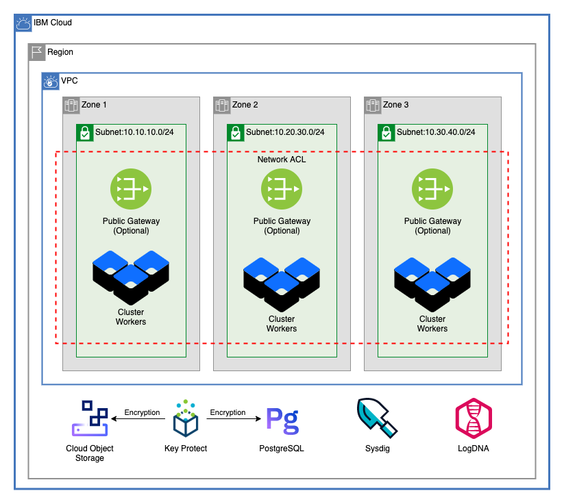

# Multizone IKS on VPC Architecture

This architecture creates a VPC, an IKS Cluster on that VPC, and many commonly used cloud resources

---

## Table of Contents

1. [Multizone VPC](##multizone-vpc)
2. [VPC Cluster](##vpc-cluster)
3. [Service Instances](##service-instances)
4. [Module Variables](##Module-Variables)

---

## Multizone VPC

This module creates a VPC in three zones of a single region, creates the ACL used by those subnets, and optionally provisions public gateways in all three zones. To read more about this module, refer to the [Multizone VPC README](./multizone_vpc/README.md).

---

## VPC Cluster

This module provisions the IKS cluster for this architecture. Optinally, it can enable ALBs and create additional worker pools. To read more about this module, refer to the [VPC Cluster README](./vpc_cluster/README.md)

---

## Service Instances

This architecture creates the following IBM Cloud service instances:

- [Key Protect](https://cloud.ibm.com/docs/key-protect?topic=key-protect-about)
- [Cloud Object Storage](https://cloud.ibm.com/docs/cloud-object-storage?topic=cloud-object-storage-about-cloud-object-storage)
- [Databases for PostgreSQL](https://cloud.ibm.com/docs/databases-for-postgresql/getting-started.html)
- [Log Analysis with LogDNA](https://cloud.ibm.com/docs/Log-Analysis-with-LogDNA?topic=Log-Analysis-with-LogDNA-getting-started)
- [Sysdig Moniroting](https://cloud.ibm.com/docs/Monitoring-with-Sysdig?topic=Monitoring-with-Sysdig-getting-started)

It will also create a root key for the Key Protect instance, use that key to encrypt the PostgreSQL database and Cloud Object Storage instances, and creates service-to-service authorization policies to allow for PostgreSQL and Cloud Object Storage to read from the Key Protect Instance.

---

## Module Variables

Variable | Type | Description | Default
---------|------|-------------|--------
`ibmcloud_api_key` | string | The IBM Cloud platform API key needed to deploy IAM enabled resources |
`unique_id` | string | A unique identifier need to provision resources. Must begin with a letter | `asset-roks-gen2`
`ibm_region` | string | IBM Cloud region where all resources will be deployed |
`resource_group` | string | Name of resource group to create VPC | `asset-development`
`generation` | String | generation for VPC. Can be 1 or 2 | `2`
`enable_public_gateway` | String | Enable public gateways for subnets, true or false | `true`
`cidr_blocks` | list | A list of CIDR blocks for the VPC subnets | `[`
`acl_rules` | String | Access control list rule set |  `[`  `{`   `name        = "egress"`   `action      = "allow"`   `source      = "0.0.0.0/0"`    `destination = "0.0.0.0/0"`   `direction   = "inbound"` `},` `{`   `name        = "ingress"`    `action      = "allow"`   `source      = "0.0.0.0/0"`  `destination = "0.0.0.0/0"`   `direction   = "outbound"` `}`   `]`
`machine_type` | string | The flavor of VPC worker node to use for your cluster | `bx2.4x16`
`workers_per_zone` | number | Number of workers to provision in each subnet. Openshift worker pool size must be 2 or greater. | `2`
`disable_public_service_endpoint` | bool | Disable public service endpoint for cluster | `false`
`kube_version` | string | Specify the Kubernetes version, including the major.minor version. To see available versions, run ibmcloud ks versions. To use the default, leave string empty | `""`
`wait_till` | string | To avoid long wait times when you run your Terraform code, you can specify the stage when you want Terraform to mark the cluster resource creation as completed. Depending on what stage you choose, the cluster creation might not be fully completed and continues to run in the background. However, your Terraform code can continue to run without waiting for the cluster to be fully created. Supported args are `MasterNodeReady`, `OneWorkerNodeReady`, and `IngressReady` | `IngressReady`
`tags` | list(string) | A list of tags to add to the cluster | `[]`
`worker_pools` | String | List of maps describing worker pools. Worker pools must have at least 2 workers per zone | `[]`
`service_endpoints` | string | Service endpoints for resource instances. Can be `public`, `private`, or `public-and-private` | `private`
`kms_plan` | string | Plan for Key Protect | `tiered-pricing`
`kms_root_key_name` | string | Name of the root key for Key Protect instance | `root-key`
`cos_plan` | string | Plan for Cloud Object Storage instance | `standard`
`psql_plan` | string | Plan for Databases for PostgreSQL | `standard`
`logdna_plan` | string | Plan for Databases for PostgreSQL | `7-day`
`sysdig_plan` | string | Plan for Databases for PostgreSQL | `graduated-tier`
---
